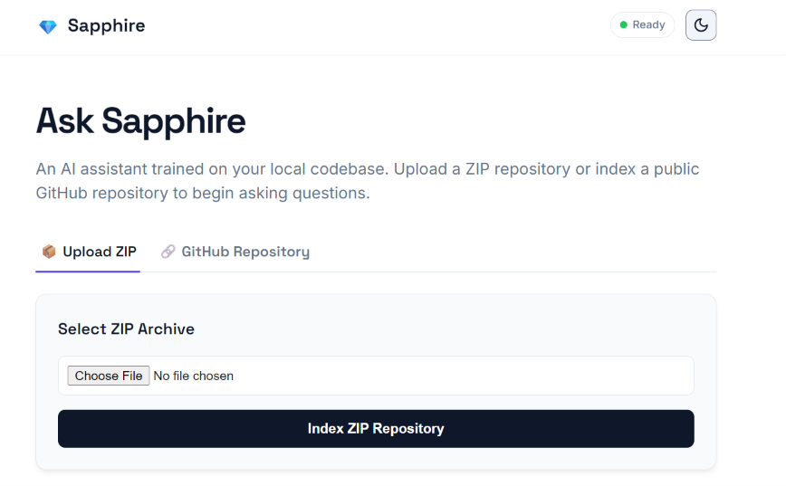
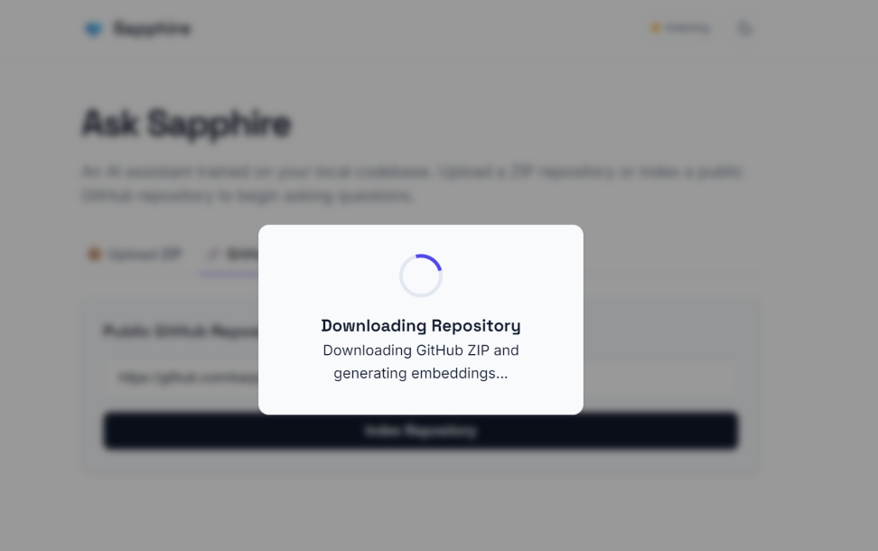
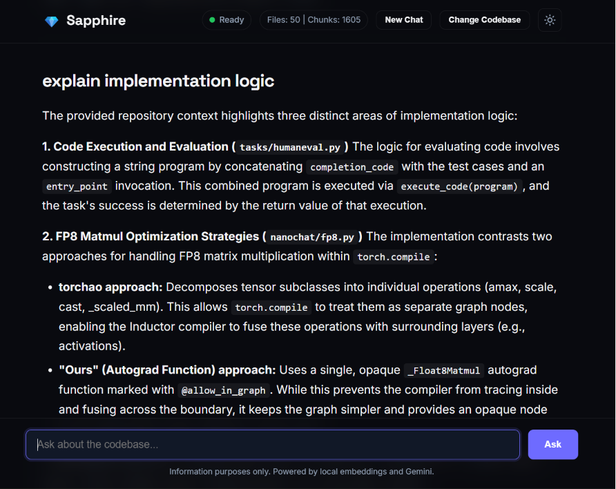
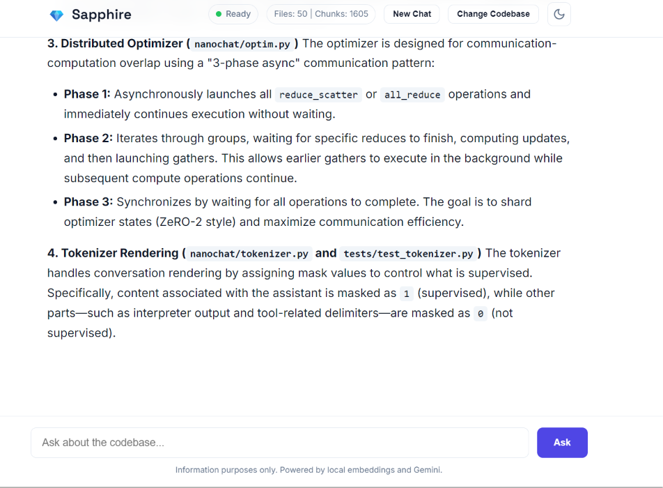

# 💎 Sapphire Codebase Assistant

A **Retrieval-Augmented Generation (RAG)** application that enables developers to chat with any GitHub repository or uploaded ZIP archive using natural language.

The application automatically downloads or extracts a codebase, chunks the source code, generates semantic embeddings locally using **FastEmbed** (with the **BAAI/bge-small-en-v1.5** model), stores them in **ChromaDB**, retrieves the most relevant code snippets for each query, and uses an LLM to generate context-aware, grounded answers.

---
## Demo

## 🚀 Features

- 🧠 Retrieval-Augmented Generation (RAG) pipeline for source code
- 📂 Index public GitHub repositories
- 📦 Upload local project ZIP archives
- 🔍 Semantic code search using vector embeddings
- 💬 Natural language question answering over codebases
- 🗃️ ChromaDB vector database
- ⚡ FastAPI backend
- 🎨 Modern HTML/CSS/JavaScript frontend
- 📊 Repository statistics and indexing information

## 🧠 RAG Pipeline

The project follows a Retrieval-Augmented Generation (RAG) architecture.

1. **Ingestion**
   - Download a GitHub repository or upload a ZIP archive.
   - Extract and parse supported source files.

2. **Chunking**
   - Split source files into semantic code chunks while preserving metadata such as file paths and line numbers.

3. **Embedding**
   - Convert each chunk into dense vector embeddings locally using **FastEmbed** (with the **BAAI/bge-small-en-v1.5** model).

4. **Indexing**
   - Store embeddings in **ChromaDB** for efficient semantic retrieval.

5. **Retrieval**
   - Embed the user's query and retrieve the most relevant code chunks using vector similarity search.

6. **Generation**
   - Supply the retrieved context to the LLM, enabling grounded and context-aware answers about the repository.

---

## ☁️ Deploy to Render (for Free)

You can host this project on **Render's Free Tier** as a single Python Web Service. The FastAPI backend automatically serves the responsive web interface at the root URL (`/`), meaning you only need to run one free service.

### Option 1: Render Blueprint (Recommended)
1. Commit and push this repository to your GitHub account (make sure to include [render.yaml](file:///c:/Users/Vishnu%20Kant/Desktop/sapphire-codebase-assistant/render.yaml)).
2. Go to the **Render Dashboard**, click **New +**, and select **Blueprint**.
3. Connect your GitHub repository.
4. Render will automatically detect the `render.yaml` configuration and pre-fill the settings:
   - **Service Type**: Web Service
   - **Environment**: Python
   - **Build Command**: `pip install -r requirements.txt`
   - **Start Command**: `uvicorn backend.main:app --host 0.0.0.0 --port $PORT`
5. In the **GEMINI_API_KEY** field under Environment Variables, enter your Google Gemini API Key.
6. Click **Deploy**.

### Option 2: Manual Web Service
If you prefer to configure it manually:
1. Click **New +** -> **Web Service** in your Render dashboard and link your repository.
2. Configure the settings:
   - **Runtime**: `Python`
   - **Build Command**: `pip install -r requirements.txt`
   - **Start Command**: `uvicorn backend.main:app --host 0.0.0.0 --port $PORT`
3. Add the following environment variables:
   - `GEMINI_API_KEY`: `<your_gemini_api_key>`
   - `PYTHON_VERSION`: `3.11.9`
4. Click **Deploy Web Service**.